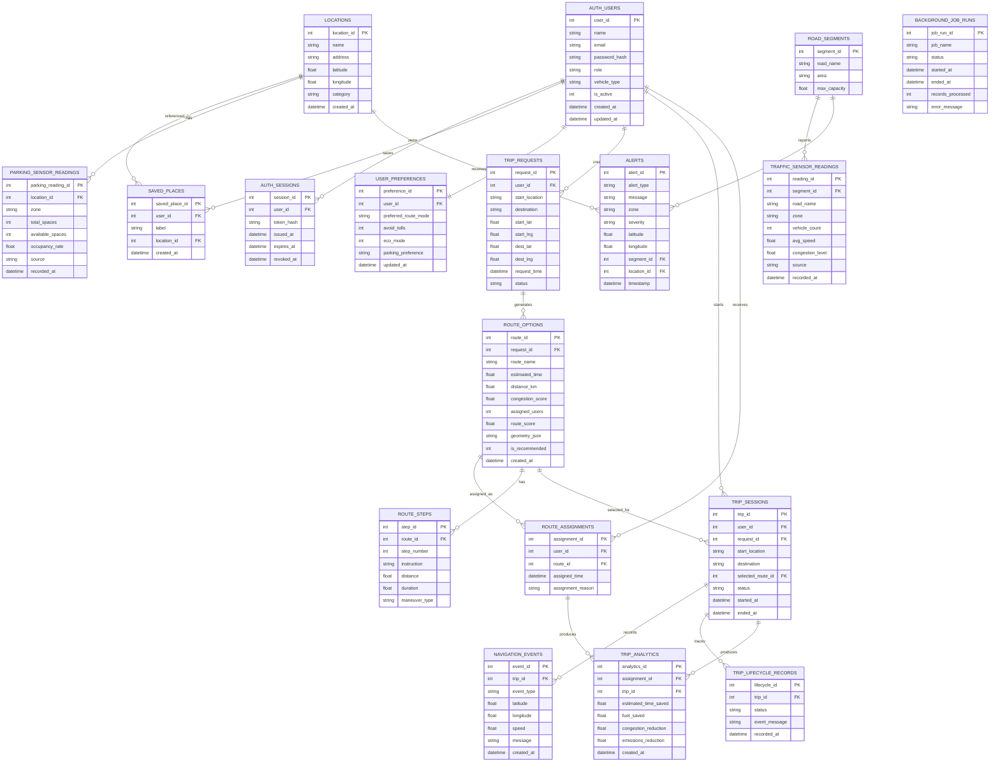

# FlowSync ER Diagram

This ERD represents the Backend Complete v1 database target for the final FlowSync smart mobility app.

It supports:

- users/auth
- locations/search
- saved places
- trip sessions
- route assignments
- route steps
- navigation events
- alerts
- parking data
- IoT sensor data
- background jobs
- trip lifecycle records

## Entity Explanation

### Users/Auth

`auth_users` stores authenticated users, roles, vehicle type, and account status. `auth_sessions` stores session/token records for login tracking.

### Locations/Search

`locations` stores searchable Dubai places used by the frontend trip form and map search.

Seeded locations include Dubai Mall, Dubai Marina, Downtown Dubai, Business Bay, DXB Airport, Jumeirah, Sharjah, and Academic City.

### Saved Places

`saved_places` stores user shortcuts such as Home, Work, University, and Airport.

### Trip Sessions

`trip_sessions` represents active or completed navigation sessions. It connects a user to a selected route and stores trip status.

### Route Assignments

`route_assignments` stores which route was assigned to a user and why FlowSync recommended it.

### Route Steps

`route_steps` stores turn-by-turn instructions for route guidance.

### Navigation Events

`navigation_events` stores live trip events such as location updates, reroutes, speed updates, and arrival events.

### Alerts

`alerts` stores Waze-style alerts such as traffic, accident, roadwork, congestion, and airport delay messages.

### Parking Data

`parking_sensor_readings` stores simulated or real parking availability near important locations.

### IoT Sensor Data

`traffic_sensor_readings` stores simulated or real traffic sensor readings such as vehicle count, average speed, and congestion level.

### Background Jobs

`background_job_runs` stores backend job history for scheduled syncs, analytics updates, database backups, and sensor refresh tasks.

### Trip Lifecycle Records

`trip_lifecycle_records` stores the history of trip status changes from requested to active, completed, cancelled, or rerouted.