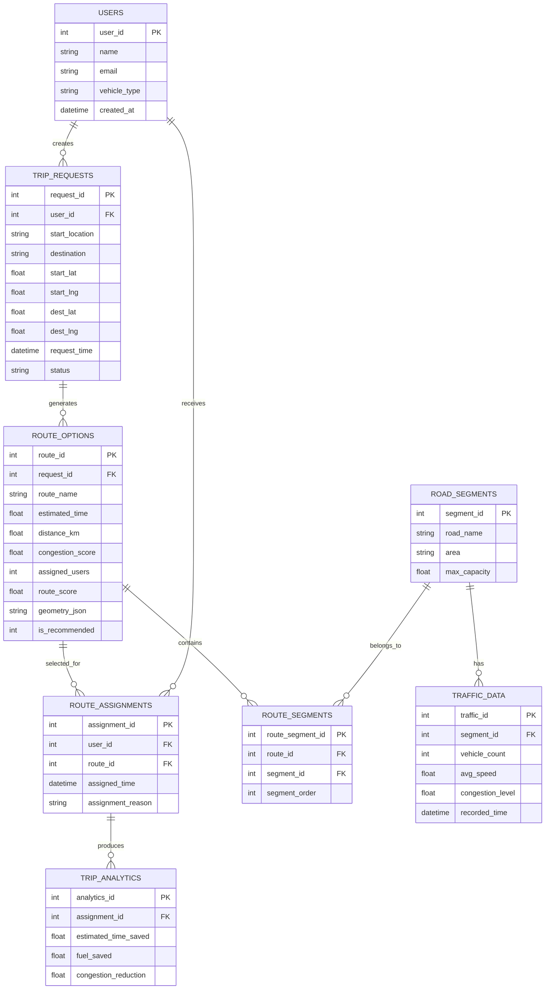

# FlowSync ER Diagram

```mermaid
erDiagram
    USERS ||--o{ TRIP_REQUESTS : creates
    TRIP_REQUESTS ||--o{ ROUTE_OPTIONS : generates
    ROUTE_OPTIONS ||--o{ ROUTE_ASSIGNMENTS : selected_for
    USERS ||--o{ ROUTE_ASSIGNMENTS : receives
    ROUTE_OPTIONS ||--o{ ROUTE_SEGMENTS : contains
    ROAD_SEGMENTS ||--o{ ROUTE_SEGMENTS : belongs_to
    ROAD_SEGMENTS ||--o{ TRAFFIC_DATA : has
    ROUTE_ASSIGNMENTS ||--o{ TRIP_ANALYTICS : produces

    USERS {
        int user_id PK
        string name
        string email
        string vehicle_type
        datetime created_at
    }

    TRIP_REQUESTS {
        int request_id PK
        int user_id FK
        string start_location
        string destination
        float start_lat
        float start_lng
        float dest_lat
        float dest_lng
        datetime request_time
        string status
    }

    ROUTE_OPTIONS {
        int route_id PK
        int request_id FK
        string route_name
        float estimated_time
        float distance_km
        float congestion_score
        int assigned_users
        float route_score
        string geometry_json
        int is_recommended
    }

    ROUTE_ASSIGNMENTS {
        int assignment_id PK
        int user_id FK
        int route_id FK
        datetime assigned_time
        string assignment_reason
    }

    ROAD_SEGMENTS {
        int segment_id PK
        string road_name
        string area
        float max_capacity
    }

    TRAFFIC_DATA {
        int traffic_id PK
        int segment_id FK
        int vehicle_count
        float avg_speed
        float congestion_level
        datetime recorded_time
    }

    ROUTE_SEGMENTS {
        int route_segment_id PK
        int route_id FK
        int segment_id FK
        int segment_order
    }

    TRIP_ANALYTICS {
        int analytics_id PK
        int assignment_id FK
        float estimated_time_saved
        float fuel_saved
        float congestion_reduction
    }
```