# FlowSync Relational Model Diagram

This diagram shows the relational model for the final FlowSync database.  
It focuses on primary keys, foreign keys, and how the main database tables connect for real routing, mobile navigation, selected route persistence, alerts, reports, analytics, and parking support.

```mermaid
erDiagram

    ROLES ||--o{ USERS : role_id
    USERS ||--|| USER_PROFILES : user_id
    USERS ||--o{ VEHICLES : user_id
    USERS ||--|| USER_PREFERENCES : user_id
    USERS ||--o{ SAVED_PLACES : user_id
    USERS ||--o{ LOGIN_SESSIONS : user_id
    USERS ||--o{ REFRESH_TOKENS : user_id
    USERS ||--o{ AUDIT_LOGS : user_id

    EMIRATES ||--o{ CITIES : emirate_id
    CITIES ||--o{ AREAS : city_id
    AREAS ||--o{ LOCATIONS : area_id
    LOCATION_CATEGORIES ||--o{ LOCATIONS : category_id
    LOCATIONS ||--o{ SAVED_PLACES : location_id
    LOCATIONS ||--o{ POPULAR_PLACES : location_id
    USERS ||--o{ SEARCH_HISTORY : user_id
    LOCATIONS ||--o{ SEARCH_HISTORY : selected_location_id

    USERS ||--o{ TRIP_REQUESTS : user_id
    VEHICLES ||--o{ TRIP_REQUESTS : vehicle_id
    LOCATIONS ||--o{ TRIP_REQUESTS : start_location_id
    LOCATIONS ||--o{ TRIP_REQUESTS : destination_location_id

    TRIP_REQUESTS ||--o{ ROUTE_OPTIONS : trip_request_id
    ROUTE_OPTIONS ||--o{ ROUTE_COORDINATES : route_id
    ROUTE_OPTIONS ||--o{ ROUTE_STEPS : route_id
    ROUTE_OPTIONS ||--o{ ROUTE_SEGMENTS : route_id
    ROAD_SEGMENTS ||--o{ ROUTE_SEGMENTS : road_segment_id

    TRIP_REQUESTS ||--o{ ROUTE_ASSIGNMENTS : trip_request_id
    USERS ||--o{ ROUTE_ASSIGNMENTS : user_id
    ROUTE_OPTIONS ||--o{ ROUTE_ASSIGNMENTS : route_id

    TRIP_REQUESTS ||--o{ TRIP_SESSIONS : trip_request_id
    USERS ||--o{ TRIP_SESSIONS : user_id
    ROUTE_ASSIGNMENTS ||--o{ TRIP_SESSIONS : assignment_id
    ROUTE_OPTIONS ||--o{ TRIP_SESSIONS : selected_route_id
    TRIP_SESSIONS ||--o{ NAVIGATION_PROGRESS : session_id
    TRIP_SESSIONS ||--o{ TRIP_STATUS_HISTORY : session_id
    TRIP_SESSIONS ||--o{ TRIP_FEEDBACK : session_id

    ROUTE_OPTIONS ||--o{ ROUTE_SCORES : route_id
    ROUTE_OPTIONS ||--o{ ROUTE_LOADS : route_id
    TRIP_REQUESTS ||--o{ DISTRIBUTION_DECISIONS : trip_request_id
    ROUTE_OPTIONS ||--o{ DISTRIBUTION_DECISIONS : selected_route_id
    ROUTE_OPTIONS ||--o{ ROUTE_DEMAND_HISTORY : route_id
    ROUTE_ASSIGNMENTS ||--o{ ASSIGNMENT_REASONS : assignment_id

    EMIRATES ||--o{ ROAD_SEGMENTS : emirate_id
    CITIES ||--o{ ROAD_SEGMENTS : city_id
    AREAS ||--o{ ROAD_SEGMENTS : area_id
    ROAD_SEGMENTS ||--o{ TRAFFIC_SNAPSHOTS : road_segment_id
    ROAD_SEGMENTS ||--o{ CONGESTION_HISTORY : road_segment_id
    ROAD_SEGMENTS ||--o{ ROAD_INCIDENTS : road_segment_id
    ROAD_SEGMENTS ||--o{ ROAD_CLOSURES : road_segment_id
    ROAD_SEGMENTS ||--o{ SPEED_LIMITS : road_segment_id
    ROAD_SEGMENTS ||--o{ TOLL_GATES : road_segment_id

    ROAD_SEGMENTS ||--o{ ALERTS : road_segment_id
    LOCATIONS ||--o{ ALERTS : location_id
    USERS ||--o{ USER_NOTIFICATIONS : user_id
    ALERTS ||--o{ USER_NOTIFICATIONS : alert_id

    USERS ||--o{ USER_REPORTS : reported_by_user_id
    ROUTE_OPTIONS ||--o{ USER_REPORTS : route_id
    ROAD_SEGMENTS ||--o{ USER_REPORTS : road_segment_id
    USER_REPORTS ||--o{ USER_REPORT_CONFIRMATIONS : report_id
    USERS ||--o{ USER_REPORT_CONFIRMATIONS : user_id

    USERS ||--o{ EMERGENCY_VEHICLES : user_id
    EMERGENCY_VEHICLES ||--o{ EMERGENCY_ROUTES : emergency_vehicle_id
    ROUTE_OPTIONS ||--o{ EMERGENCY_ROUTES : route_id

    TRIP_SESSIONS ||--o{ TRIP_ANALYTICS : session_id
    ROUTE_ASSIGNMENTS ||--o{ TRIP_ANALYTICS : assignment_id
    USERS ||--o{ TRIP_ANALYTICS : user_id
    ROUTE_OPTIONS ||--o{ ROUTE_PERFORMANCE : route_id
    ROAD_SEGMENTS ||--o{ CONGESTION_ANALYTICS : road_segment_id
    AREAS ||--o{ CONGESTION_ANALYTICS : area_id

    LOCATIONS ||--o{ PARKING_ZONES : location_id
    PARKING_ZONES ||--o{ PARKING_SPOTS : parking_zone_id
    PARKING_ZONES ||--o{ PARKING_AVAILABILITY : parking_zone_id
    PARKING_ZONES ||--o{ PARKING_PREDICTIONS : parking_zone_id
    USERS ||--o{ PARKING_BOOKING_HISTORY : user_id
    PARKING_ZONES ||--o{ PARKING_BOOKING_HISTORY : parking_zone_id
    PARKING_SPOTS ||--o{ PARKING_BOOKING_HISTORY : parking_spot_id

    USERS ||--o{ ADMIN_ACTIONS : admin_user_id
    USERS ||--o{ API_LOGS : user_id
    USERS ||--o{ ERROR_LOGS : user_id

    ROLES {
        int role_id PK
        string role_name
        string description
        string status
    }

    USERS {
        int user_id PK
        int role_id FK
        string name
        string email
        string password_hash
        string account_status
        datetime created_at
    }

    LOCATIONS {
        int location_id PK
        int area_id FK
        int category_id FK
        string name
        string display_name
        float latitude
        float longitude
        string city
        string area
        string category
        string provider_name
        string external_place_id
        string search_keywords
        string aliases
    }

    GEOCODING_CACHE {
        int geocoding_cache_id PK
        string query_text
        string provider_name
        string provider_place_id
        float latitude
        float longitude
        string raw_response
        datetime created_at
        datetime expires_at
    }

    MAP_PROVIDER_CACHE {
        int cache_id PK
        string provider_name
        string request_type
        string request_hash
        string response_json
        datetime created_at
        datetime expires_at
    }

    TRIP_REQUESTS {
        int trip_request_id PK
        int user_id FK
        int vehicle_id FK
        int start_location_id FK
        int destination_location_id FK
        string start_location
        string destination
        float start_latitude
        float start_longitude
        float destination_latitude
        float destination_longitude
        string vehicle_type
        string route_preference
        string user_role
        string status
    }

    ROUTE_OPTIONS {
        int route_id PK
        int trip_request_id FK
        string route_public_id
        string route_name
        float estimated_time_min
        string eta_text
        float distance_km
        string distance_text
        float traffic_delay_min
        float congestion_score
        float flowsync_score
        int assigned_users
        int road_capacity
        float load_ratio
        string load_status
        string recommendation_reason
        int is_recommended
    }

    ROUTE_COORDINATES {
        int route_coordinate_id PK
        int route_id FK
        string route_public_id
        int point_index
        float latitude
        float longitude
        float distance_from_start_m
        string provider_name
    }

    ROUTE_STEPS {
        int route_step_id PK
        int route_id FK
        int step_index
        string instruction
        string maneuver
        string street_name
        float distance_m
        float duration_min
        float latitude
        float longitude
    }

    ROUTE_ASSIGNMENTS {
        int assignment_id PK
        int trip_request_id FK
        int user_id FK
        int route_id FK
        string assignment_reason
        string status
    }

    TRIP_SESSIONS {
        int session_id PK
        int trip_request_id FK
        int user_id FK
        int assignment_id FK
        int selected_route_id FK
        string selected_route_public_id
        string status
        int current_step_index
        float total_distance_km
        float total_time_min
        float summary_congestion_score
        float summary_flowsync_score
        float fuel_saved_estimate
        float co2_saved_estimate
        datetime started_at
        datetime ended_at
    }

    NAVIGATION_PROGRESS {
        int navigation_progress_id PK
        int session_id FK
        int current_step_index
        int closest_route_point_index
        float latitude
        float longitude
        float remaining_distance_km
        float remaining_time_min
        float progress_percentage
        datetime recorded_at
    }

    ROAD_SEGMENTS {
        int road_segment_id PK
        string road_name
        int emirate_id FK
        int city_id FK
        int area_id FK
        string road_type
        int max_capacity
        string status
    }

    TRAFFIC_SNAPSHOTS {
        int traffic_snapshot_id PK
        int road_segment_id FK
        int vehicle_count
        float average_speed
        float congestion_level
        float congestion_score
        float delay_min
        string source
        datetime recorded_at
    }

    ALERTS {
        int alert_id PK
        string title
        string alert_type
        string message
        string severity
        float latitude
        float longitude
        int road_segment_id FK
        int location_id FK
        string status
        datetime expires_at
    }

    ROAD_INCIDENTS {
        int incident_id PK
        int road_segment_id FK
        string incident_type
        string title
        string severity
        float latitude
        float longitude
        string status
        datetime resolved_at
        datetime expires_at
    }

    ROAD_CLOSURES {
        int closure_id PK
        int road_segment_id FK
        string title
        string reason
        string severity
        float latitude
        float longitude
        string status
        datetime start_time
        datetime end_time
    }

    USER_REPORTS {
        int report_id PK
        string report_type
        string description
        float latitude
        float longitude
        int road_segment_id FK
        int route_id FK
        int reported_by_user_id FK
        string severity
        string status
        int confirmation_count
        int dismissed_count
        datetime created_at
        datetime expires_at
    }

    USER_REPORT_CONFIRMATIONS {
        int confirmation_id PK
        int report_id FK
        int user_id FK
        string confirmation_type
        datetime created_at
    }

    ROUTE_SCORES {
        int route_score_id PK
        int route_id FK
        float time_score
        float distance_score
        float congestion_score
        float load_score
        float incident_score
        float final_score
    }

    ROUTE_LOADS {
        int route_load_id PK
        int route_id FK
        int active_users
        int road_capacity
        float load_percentage
        string load_status
    }

    DISTRIBUTION_DECISIONS {
        int decision_id PK
        int trip_request_id FK
        int selected_route_id FK
        int fastest_route_id FK
        int overloaded_route_id FK
        string decision_reason
    }

    TRIP_ANALYTICS {
        int analytics_id PK
        int session_id FK
        int assignment_id FK
        int user_id FK
        float estimated_time_saved_minutes
        float fuel_saved_liters
        float co2_saved_kg
        float congestion_reduction_percent
    }

    PARKING_ZONES {
        int parking_zone_id PK
        int location_id FK
        string zone_name
        float latitude
        float longitude
        int total_spaces
        int capacity
        float price_per_hour
        string status
    }
```

## Key relational model points

- `trip_requests` is the parent table for generated route options.
- `route_options` stores each possible route.
- `route_coordinates` stores ordered polyline points using `point_index`.
- `route_steps` stores ordered turn-by-turn instructions using `step_index`.
- `trip_sessions.selected_route_id` links back to `route_options.route_id`.
- `trip_sessions.selected_route_public_id` stores public IDs like `ROUTE-D`.
- `navigation_progress` stores GPS progress for each trip session.
- `alerts`, `road_incidents`, `road_closures`, and `user_reports` are map-ready because they include coordinates.
- `route_scores`, `route_loads`, and `distribution_decisions` support FlowSync route balancing.

